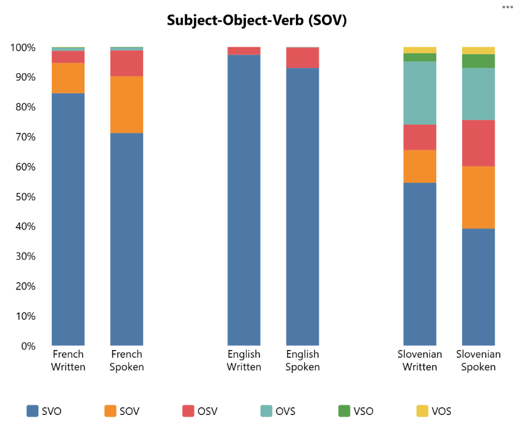

# Sinteza ugotovitev z besedilnim odgovorom na izhodiščna raziskovalna vprašanja:

WALS

FR	SVO

EN	SVO

NO	SVO

SL	SVO

SP	SVO

Analiza vrstnega reda osebka, predmeta in glagola (SOV) pokaže, da govorni jezik izkazuje večjo fleksibilnost kot pisni jezik, saj v vseh preučevanih jezikih – angleščini, francoščini, obeh uradnih variantah norveščine, slovenščini ter španščini – opazimo zmanjšanje pogostnosti (sicer najpogostejšega pisnega) vzorca SVO v govorni rabi.

V francoščini se ta zniža z 84,5 % (pisni) na 71,2 % (govorni), medtem ko je sprememba v slovenščini največja (54,5 % → 39,2 %). Vzorec SOV se v govoru poveča tako pri francoščini (10,2 % → 19,1 %) kot pri slovenščini (10,9 % → 20,8 %). Tudi OSV in OVS se v govoru pojavljata pogosteje: V francoščini se pogostost OSV poveča s 4,1 % na 8,7 %, pri slovenščini z 8,5 % na 15,6 % in pri angleščini z 2,6 % na 6,9 %. OVS se v slovenščini pojavlja približno enako pogosto v obeh modalitetah (21,1 % pisni, 17,4 % govorni). Angleščina je glede na podatke najmanj fleksibilna, saj SVO v pisnem jeziku predstavlja kar 97,4 %, v govornem pa 92,9 %, medtem ko je delež ostalih vzorcev zanemarljiv. Nasprotno pa slovenščina izkazuje največjo raznolikost, saj se vzorci precej razlikujejo že v pisnem jeziku, kar se samo še poveča pri govornem. Te ugotovitve bi lahko nakazovale na dejstvo, da morfološko bogatejši jeziki, kot je npr. slovenščina, vsebujejo bolj raznolike vzorce vrstnega reda osebka, predmeta in glagola.

Podobne rezultate kaže tudi raziskava vrstnega reda glagola in predmeta (VO): Tudi tu se pogostost VO v govoru zmanjšuje v vseh jezikih. Najbolj je to izrazito v slovenščini (62,7 % → 50,3 %) in francoščini (85,4 % → 74,2 %). Tudi v angleščini opazimo zmanjšanje, a le majhno (98,4 % → 95,2 %). Slovenščina se tako ponovno izkaže za najbolj fleksibilno izmed proučevanih jezikov.

[Kajini zapiski -->]

Rezultati za OVS:

- https://unilj-my.sharepoint.com/:x:/r/personal/nh23084_student_uni-lj_si/_layouts/15/Doc.aspx?sourcedoc=%7B0DE5D74C-439E-47CD-AA0F-AE24DF1DE181%7D&file=OVS_compare_three_corpora.xlsx&action=default&mobileredirect=true

- https://wals-charts.netlify.app/chart1

- RQ1: Ali se besedni red v govoru razlikuje od pisnega jezika?

- Da, v vseh treh jezikih.

- RQ2: Kako se besedni red v govoru razlikuje od pisnega jezika?

- V vseh treh jezikih opazimo:

- Zmanjšanje dominantnega besednega reda (SVO) na račun drugih

- Večja variantnost besednega reda v govoru kot v pisnem

- --> govor omogoča večjo fleksibilnost besednega reda

- Vendarle pa je stopnja te fleksibilosti odvisna od jezika > večja variabilnost tam, kjer je besedni red že sicer bolj fleksibilen (prim. ang-sl)

- Posebnosti po jezikih: :

- V francoščini povečanje SOV in OSV (glagol na koncu).

- Podobno porast SOV in OSV tudi v slovenščini (SVO ni več dominanten!), a poleg tega tudi znižanje OVS (Jabolko je kupila mama --> Tak poudarek aktanta v govoru običajno prozodičen).

- V angleščini rahlo povečanje OSV.

---

*Figure(s) from the original document:*

